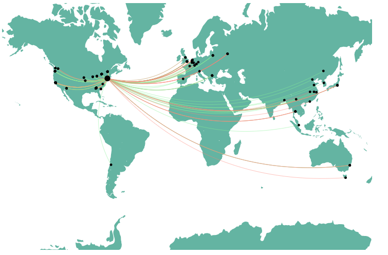

# Site Traffic Visualization

This project provides a visual representation of traffic to a site using data from an nginx access log. It visualizes the geographic origin of the requests and how they interact with the server.




## Features

- Parses nginx access log to extract relevant traffic data.
- Uses geolocation services to determine the origin of traffic.
- Frontend visualization using D3.js to display the flow of traffic on a world map.
- Backend implemented using Flask to serve traffic data to the frontend.

## Prerequisites

- Python 3.x
- Flask
- Flask-CORS
- D3.js

## Installation and Setup

1. Clone the repository:
\```
git clone <repository-link>
\```

2. Navigate to the project directory and install required Python packages:
\```
pip install flask flask_cors
\```

3. Start the Flask server:
\```
python app.py
\```

4. Open the `index.html` in a browser to view the visualization.

## Project Structure

- **Frontend**:
  - `index.html`: Main HTML file that includes links to styles and scripts.
  - `appCaller.js`: Fetches traffic data from the backend.
  - `slider.js`: Implements the time range slider.
  - `mapDrawer.js`: Renders the world map and visualizes traffic links and nodes using D3.js.

- **Backend**:
  - `app.py`: Flask server that serves traffic data endpoints.
  - `addGeolocation.py`: Script to add geolocation data to the parsed access log.
  - `accessLogToCSV.py`: Script to parse the nginx access log and convert it to a CSV file.

## Usage

Once the Flask server is up, adjust the time range using the slider on the frontend to view the traffic for the selected period. The visualization will show the origin of the requests and their interaction with the server.

## License

This project is open source and available under the [MIT License](LICENSE).
